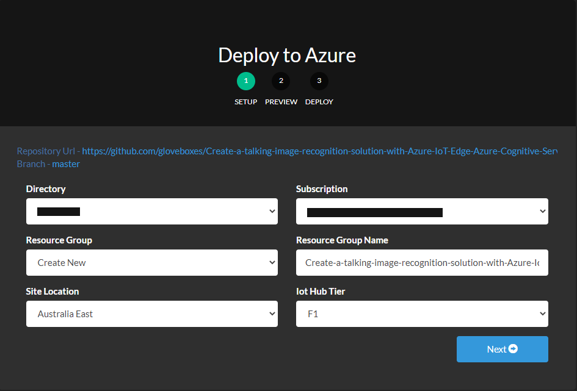
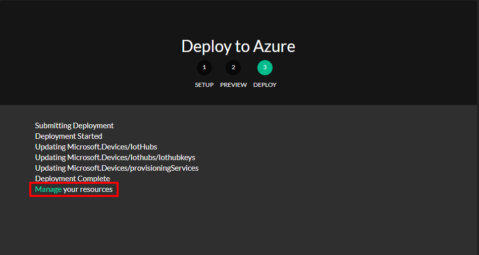

# Azure Services

This solution will use three services

1. [Azure IoT Hub](https://docs.microsoft.com/en-us/azure/iot-hub/)
2. [Azure Custom Vision](https://docs.microsoft.com/en-us/azure/cognitive-services/custom-vision-service/)
3. [Azure Speech Services](https://docs.microsoft.com/en-us/azure/cognitive-services/speech-service/)

---
## Create an Azure Subscription

If you do not have an Azure Subscription then [create an Azure Subscription](https://azure.microsoft.com/en-us/free/). Students can sign up for a free [Azure for Students](https://azure.microsoft.com/en-us/free/students/) subscription that does not require credit card verification.

---

## Prepare Azure resources

You can prepare Azure cloud resources with the Azure CLI, the Azure Portal Web interface, or deployment templates. For this module, we will be using an Azure deployment template.

Click the **Deploy to Azure** button to deploy Azure resources. An IoT Hub will be created, along with an IoT Edge Device.

1. Select or create a new resource group, choose the site located closest to you, and select the IoT Hub Tier. The default IoT Hub tier is the free **F1** tier. You can only have one free IoT Hub per subscription. If you already have a free IoT Hub then either select S1 ([pricing](https://azure.microsoft.com/en-us/pricing/details/iot-hub/)) or delete your existing free IoT Hub before proceeding.

    

2. Click **Next**.
3. Click **Deploy**. The deployment will take three to four minutes to complete.

    

4. When the deployment has completed, click on **Manage your resources**. You will see two services listed in the Azure Web Portal. The Device Provisioning Service (DPS) and the IoT Hub. Appended to the resource names is a random string to ensure the names are globally unique.

    

5. **DO NOT** close the Azure Web Portal and you will be needing it shortly.

---

## Creating the Fruit Classification Model

The [Azure Custom Vision](https://docs.microsoft.com/en-us/azure/cognitive-services/custom-vision-service/) service is a simple way to create an image classification machine learning model without having to be a data science or machine learning expert. You simply upload multiple collections of labelled images. For example, you could upload a collection of banana images and label them as 'banana'.

To create your own classification model read [How to build a classifier with Custom Vision](https://docs.microsoft.com/en-us/azure/cognitive-services/custom-vision-service/getting-started-build-a-classifier/?WT.mc_id=devto-blog-dglover) for more information. It is important to have a good variety of labelled images so be sure to read [How to improve your classifier](https://docs.microsoft.com/en-us/azure/cognitive-services/custom-vision-service/getting-started-improving-your-classifier/?WT.mc_id=devto-blog-dglover).

## Exporting an Azure Custom Vision Model

This "Image Classification" module includes a simple fruit classification model that was exported from Azure Custom Vision. For more information read how to [Export your model for use with mobile devices](https://docs.microsoft.com/en-us/azure/cognitive-services/custom-vision-service/export-your-model/?WT.mc_id=devto-blog-dglover). It is important to select one of the "**compact**" domains from the project settings page otherwise you will not be able to export the model.

Follow these steps to export your Custom Vision project model.

1. From the **Performance** tab of your Custom Vision project click **Export**.

    

2. Select Dockerfile from the list of available options

    

3. Then select the Linux version of the Dockerfile.

   

4. Download the docker file and unzip and you have a ready-made Docker solution with a Python Flask REST API. This was how I created the Azure IoT Edge Image Classification module in this solution. Too easy:)

## Azure Speech Services

[Azure Speech Services](https://docs.microsoft.com/en-us/azure/cognitive-services/speech-service/) supports both "speech to text" and "text to speech". For this solution, I'm using the text to speech (F0) free tier which is limited to 5 million characters per month. You will need to add the Speech service using the Azure Portal and "Grab your key" from the service.

Open the deployment.template.json file and update the BingKey with the key you copied from the Azure Speech service.

