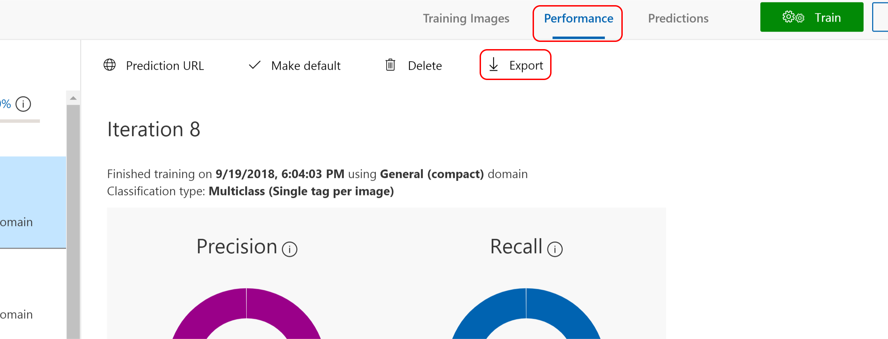

# Create Azure Cognitive Services

---

## Index

* Lab 1: [Create an Azure IoT Hub](../module_1_create_iot_hub/README.md)
* Lab 2: [Install Azure IoT Edge on your Raspberry Pi](../module_2_install_azure_iot_edge/README.md)
* Lab 3: [Set up your development environment](../module_3_set_up_computer/README.md)
* Lab 4: [Create Azure Cognitive Services](../module_4_create_azure_resources/README.md)
* Lab 5: [Build and deploy the solution](../module_5_building_the_solution/README.md)

* [Home](../../README.md)

---

## Creating the Fruit Classification Model

The [Azure Custom Vision](https://docs.microsoft.com/en-us/azure/cognitive-services/custom-vision-service/) service is a simple way to create an image classification machine learning model without having to be a data science or machine learning expert. You simply upload multiple collections of labelled images. For example, you could upload a collection of banana images and label them as 'banana'.

To create your own classification model read [How to build a classifier with Custom Vision](https://docs.microsoft.com/en-us/azure/cognitive-services/custom-vision-service/getting-started-build-a-classifier/?WT.mc_id=devto-blog-dglover) for more information. It is important to have a good variety of labelled images so be sure to read [How to improve your classifier](https://docs.microsoft.com/en-us/azure/cognitive-services/custom-vision-service/getting-started-improving-your-classifier/?WT.mc_id=devto-blog-dglover).

## Exporting an Azure Custom Vision Model

This "Image Classification" module includes a simple fruit classification model that was exported from Azure Custom Vision. For more information read how to [Export your model for use with mobile devices](https://docs.microsoft.com/en-us/azure/cognitive-services/custom-vision-service/export-your-model/?WT.mc_id=devto-blog-dglover). It is important to select one of the "**compact**" domains from the project settings page otherwise you will not be able to export the model.

Follow these steps to export your Custom Vision project model.

1. From the **Performance** tab of your Custom Vision project click **Export**.

    

2. Select Dockerfile from the list of available options

    

3. Then select the Linux version of the Dockerfile.

   

4. Download the docker file and unzip and you have a ready-made Docker solution with a Python Flask REST API. This was how I created the Azure IoT Edge Image Classification module in this solution. Too easy:)

## Azure Speech Services

[Azure Speech Services](https://docs.microsoft.com/en-us/azure/cognitive-services/speech-service/) supports both "speech to text" and "text to speech". For this solution, I'm using the text to speech (F0) free tier which is limited to 5 million characters per month. You will need to add the Speech service using the Azure Portal and "Grab your key" from the service.

Open the deployment.template.json file and update the BingKey with the key you copied from the Azure Speech service.

---

**[NEXT](../module_5_building_the_solution/README.md)**

---
