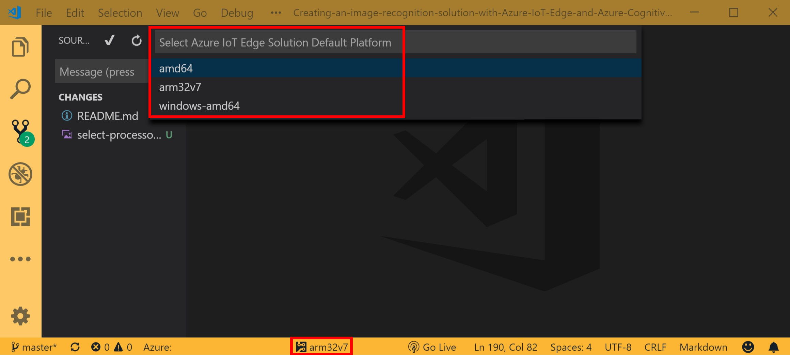
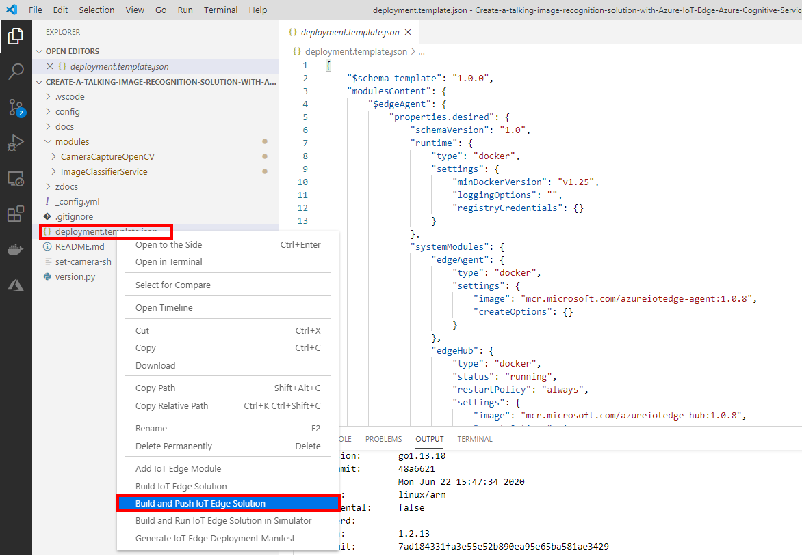

# How to install, build and deploy the solution

If you do not want to download and build the solution you can use the prebuilt Azure IoT Edge configuration from my [GitHub](https://github.com/gloveboxes?tab=repositories) repository and use the associated Docker images.

1. Download the deployment configuration file that describes the Azure IoT Edge Modules and Routes for this solution. Open the [deployment.arm32v7.json](https://raw.githubusercontent.com/gloveboxes/Creating-an-image-recognition-solution-with-Azure-IoT-Edge-and-Azure-Cognitive-Services/master/config/deployment.arm32v7.json) link and save the deployment.arm32v7.json in a known location on your computer.
1. Install the [Azure CLI](https://docs.microsoft.com/cli/azure/install-azure-cli/?WT.mc_id=devto-blog-dglover) and the [IoT extension for Azure CLI](https://github.com/Azure/azure-iot-cli-extension) command line tools. For more information, see [Deploy Azure IoT Edge modules with Azure CLI](https://docs.microsoft.com/en-us/azure/iot-edge/how-to-deploy-modules-cli/?WT.mc_id=devto-blog-dglover)
1. Open a command line console/terminal and change directory to the location where you saved the deployment.arm32v7.json file.
1. Finally, from the command line run the following command, be sure to substitute [device id] and the [hub name] values.

```bash
az iot edge set-modules --device-id [device id] --hub-name [hub name] --content deployment.arm32v7.json
```


1. Clone this GitHub repository.

   ```bash
   git clone https://github.com/gloveboxes/Creating-an-image-recognition-solution-with-Azure-IoT-Edge-and-Azure-Cognitive-Services.git
   ```

2. Install the Azure IoT Edge runtime on your Linux desktop or device (eg Raspberry Pi).

    Follow the instructions to [Deploy your first IoT Edge module to a Linux x64 device](https://docs.microsoft.com/en-us/azure/iot-edge/quickstart-linux/?WT.mc_id=devto-blog-dglover).

3. Install the following software development tools.

    1. [Visual Studio Code](https://code.visualstudio.com/)
    2. Plus, the following Visual Studio Code Extensions
        - [Azure IoT Edge](https://marketplace.visualstudio.com/items?itemName=vsciot-vscode.azure-iot-edge)
        - [JSON Tools](https://marketplace.visualstudio.com/items?itemName=eriklynd.json-tools) useful for changing the "Create Options" for a module.
    3. [Docker Community Edition](https://docs.docker.com/install/) on your development machine

4. With Visual Studio Code, open the IoT Edge solution you cloned from GitHub to your developer desktop.

## Understanding the Project Structure

The following describes the highlighted sections of the project.

1. There are two modules: CameraCaptureOpenCV and ImageClassifierService.

2. The module.json file defines the Docker build process, the module version, and your docker registry. Updating the version number, pushing the updated module to an image registry, and updating the deployment manifest for an edge device triggers the Azure IoT Edge runtime to pull down the new module to the edge device.

3. The deployment.template.json file is used by the build process. It defines what modules to build, what message routes to set up, and what version of the IoT Edge runtime to run.

4. The deployment.json file is generated from the deployment.template.json and is the [Deployment Manifest](https://docs.microsoft.com/en-us/azure/iot-edge/module-composition/?WT.mc_id=devto-blog-dglover)

5. The version.py in the project root folder is a helper app you can run on your development machine that updates the version number of each module. Useful as a change in the version number is what triggers Azure IoT Edge runtime to pull the updated module and it is easy to forget to change the module version numbers:)


## <a name='BuildingtheSolution'></a>Building the Solution

You need to ensure the image you plan to build matches the target processor architecture specified in the deployment.template.json file.

1. Specify your Docker repository in the module.json file for each module. If you are using a supported Linux Azure IoT Edge Distribution, such as Ubuntu 18.04 as your development machine and you have Azure IoT Edge installed locally then I strongly recommend setting up a local Docker Registry. It will significantly speed up your development, deployment and test cycle.

    To set up a local Docker Registry for prototyping and testing purposes.

```bash
docker run -d -p 5000:5000 --restart always --name registry registry:2
```
3. If pushing the image to a local Docker repository the specify localhost:5000. 
```json
"repository": "localhost:5000/camera-capture-opencv"
```
4. Confirm processor architecture you plan to build for.
    From the Visual Studio Code bottom bar click the currently selected processor architecture, then from the popup select the desired processor architecture.
    

6. Next, Build and Push the solution to Docker by right mouse clicking the deployment.template.json file and select "**Build and Push IoT Edge Solution**". The first build will be slow as Docker needs to pull the base layers to your local machine. If you are cross compiling to arm32v7 then the first build will be very slow as OpenCV and Python requirements need to be compiled. On a fast Intel i7-8750H processor cross compiling this solution will take approximately 40 minutes.

    

## <a name='DeployingtheSolution'></a>Deploying the Solution

When the Docker Build and Push process has completed select the Azure IoT Hub device you want to deploy the solution to. Right mouse click the deployment.json file found in the config folder and select the target device from the drop-down list.

   

## <a name='MonitoringtheSolutionontheIoTEdgeDevice'></a>Monitoring the Solution on the IoT Edge Device

Once the solution has been deployed you can monitor it on the IoT Edge device itself using the ```iotedge list``` command.

```bash
iotedge list
```

  

## <a name='MonitoringtheSolutionfromtheAzureIoTEdgeBlade'></a>Monitoring the Solution from the Azure IoT Edge Blade

You can monitor the state of the Azure IoT Edge module from the Azure IoT Hub blade on the [Azure Portal](http://portal.azure.com).

   

   Click on the device from the Azure IoT Edge blade to view more details about the modules  running on the device.

   

