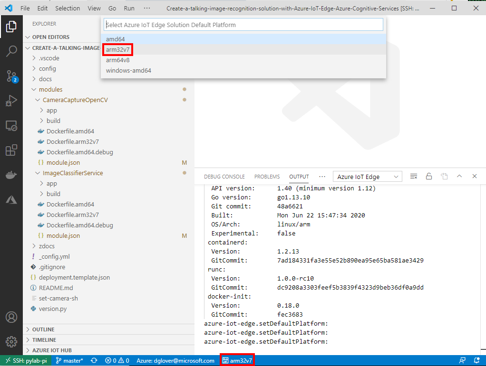
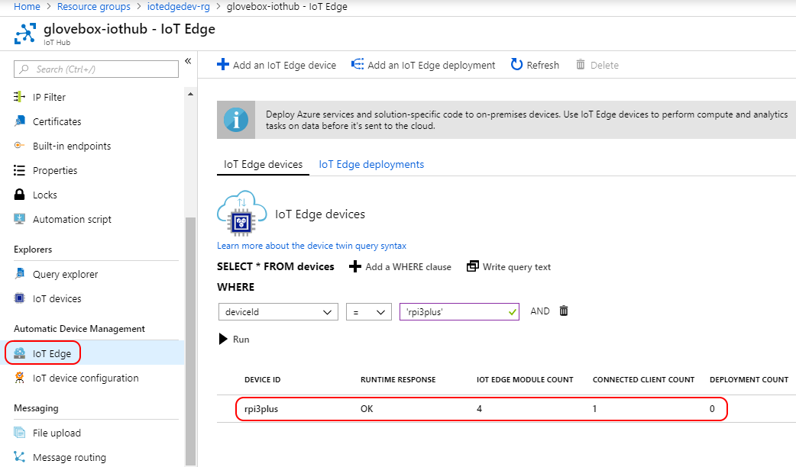

# Build and deploy the solution


## Understanding the Project Structure

The following describes the highlighted sections of the project.

1. There are two modules: CameraCaptureOpenCV and ImageClassifierService.

2. The module.json file defines the Docker build process, the module version, and your docker registry. Updating the version number, pushing the updated module to an image registry, and updating the deployment manifest for an edge device triggers the Azure IoT Edge runtime to pull down the new module to the edge device.

3. The deployment.template.json file is used by the build process. It defines what modules to build, what message routes to set up, and what version of the IoT Edge runtime to run.

4. The deployment.json file is generated from the deployment.template.json and is the [Deployment Manifest](https://docs.microsoft.com/en-us/azure/iot-edge/module-composition/?WT.mc_id=devto-blog-dglover)

5. The version.py in the project root folder is a helper app you can run on your development machine that updates the version number of each module. Useful as a change in the version number is what triggers Azure IoT Edge runtime to pull the updated module and it is easy to forget to change the module version numbers:)

      

## Building the Solution

You need to ensure the image you plan to build matches the target processor architecture. In our case, we are going to build for **arm32v7**.

1. Confirm processor architecture.
    From the Visual Studio Code bottom bar click the currently selected processor architecture, then from the popup select **arm32v7**.
    

6. Next, Build and Push the solution to Docker by right mouse clicking the deployment.template.json file and select "**Build and Push IoT Edge Solution**". The first build will be slow as Docker needs to pull the base layers to your local machine. If you are cross compiling to arm32v7 then the first build will be very slow as OpenCV and Python requirements need to be compiled. On a fast Intel i7-8750H processor cross compiling this solution will take approximately 40 minutes.

    

## Deploying the Solution

When the Docker Build and Push process has completed select the Azure IoT Hub device you want to deploy the solution to. Right mouse click the deployment.json file found in the config folder and select the target device from the drop-down list.

   

## View the device telemetry from the Azure Cloud Shell

1. You will need to know the name of the Azure IoT Hub you created. You can get the name from the Azure web portal.
    
2. Open the Azure Cloud shell at [https://shell.azure.com](https://shell.azure.com).
3. In the Cloud Shell, run the [az extension add](https://docs.microsoft.com/cli/azure/extension?view=azure-cli-latest#az-extension-add) command to add the Microsoft Azure IoT Extension to your CLI shell. The IoT Extension adds IoT Hub, IoT Edge, and IoT Device Provisioning Service (DPS) specific commands to Azure CLI.

    ```bash
    az extension add --name azure-iot
    ```

4. Start the IoT Hub Events Monitor with the following command. Be sure to use your IoT Hub name.

    ```bash
    az iot hub monitor-events --hub-name {your IoT Hub name}
    ```

5. Observe telemetry in the cloud. The output will be similar to the following screen.

    

6. Use <kbd>ctrl+c</kbd> to stop the event monitor.

## Monitoring the Solution on the IoT Edge Device

Once the solution has been deployed you can monitor it on the IoT Edge device itself using the ```iotedge list``` command.

```bash
iotedge list
```

  

## <a name='MonitoringtheSolutionfromtheAzureIoTEdgeBlade'></a>Monitoring the Solution from the Azure IoT Edge Blade

You can monitor the state of the Azure IoT Edge module from the Azure IoT Hub blade on the [Azure Portal](http://portal.azure.com).

   

   Click on the device from the Azure IoT Edge blade to view more details about the modules  running on the device.

   

